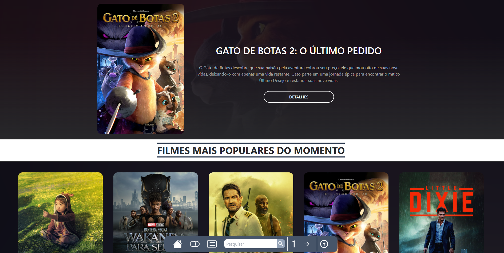
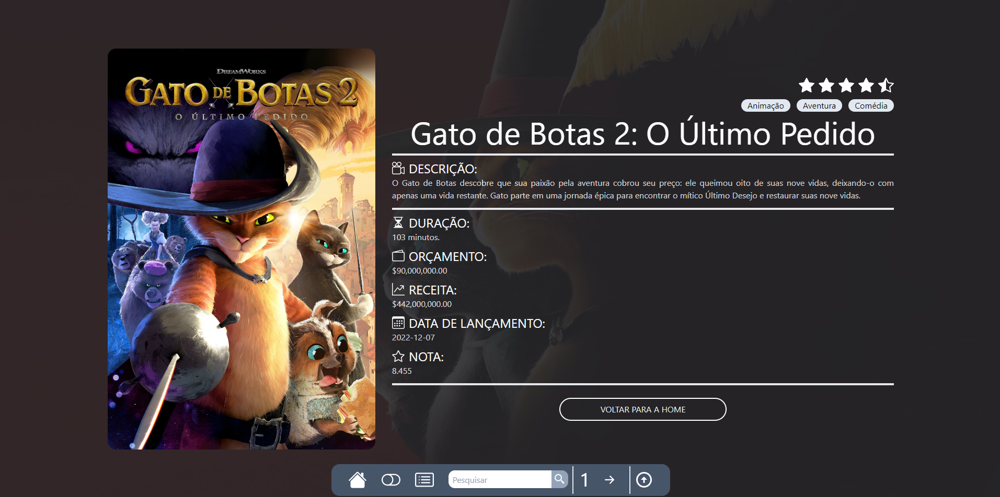
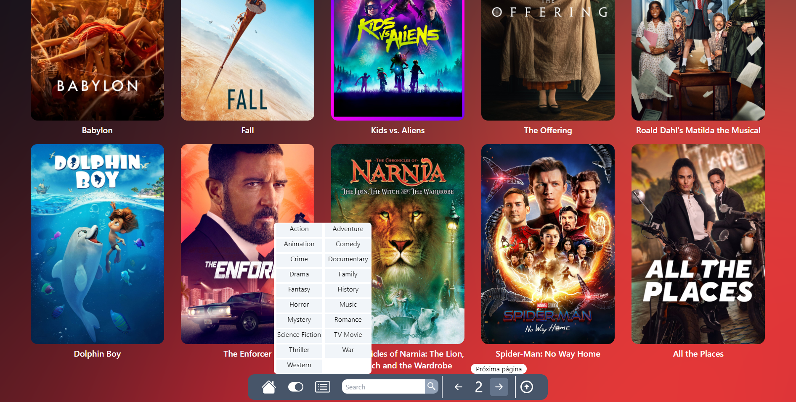

<h2 align="center">
  Catálogo de filmes
</h2>

<p align="center">
 <a href="#-sobre-o-projeto">Sobre</a> •
 <a href="#-tecnologias">Tecnologias</a> •
 <a href="#-aplicação">Aplicação</a> • 
 <a href="#-como-executar">Executar</a> 
</p>

## 💻 Sobre o projeto

Desenvolvi uma aplicação web de um catálogo de filmes onde você pode ver os filmes mais populares do momento, filtrar por gêneros, pesquisar um filme especifico e entre outras funções.
Consumi a api da The Movies DB, uma api bem completa para o que eu queria fazer. Utilizei nesse projeto React, Typescript e Tailwind. A listagem dos filmes é por sua popularidade atualmente. Fiz um esquema de paginação, mostrando 20 filmes por página. Você pode também filtrar pelos gêneros, listando apenas filmes de ação, comédio, e entre outros. Também tem a opção de pesquisar por um filme especifico, podendo até pesquisar por um filme que ainda não lançou.
E para finalizar, pode mudar a linguagem do site por meio de um botão na nav.

---

## 🛠 Tecnologias

As seguintes ferramentas foram usadas na construção do projeto:

-   **React**
-   **Typescript**
-   **Tailwind**

## 🚀 Aplicação

<p align="center">
  
</p>

<p align="center">
  
</p>

<p align="center">
  
</p>
---

## 🛠 COMO EXECUTAR

```

# Clone este repositório
$ git clone git@github.com:KaiqueBM/catalogo-de-filmes.git

# Vá para a pasta do projeto
$ cd filmes

# Instale as dependências
$ npm install

# Execute a aplicação em modo de desenvolvimento
$ npm run dev

# A aplicação será aberta na porta:5173 - acesse http://127.0.0.1:5173/

```
